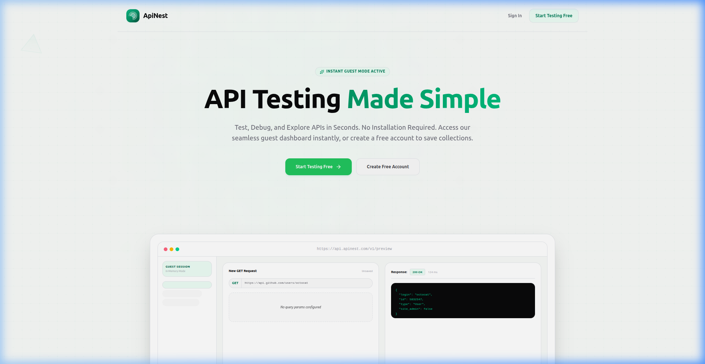
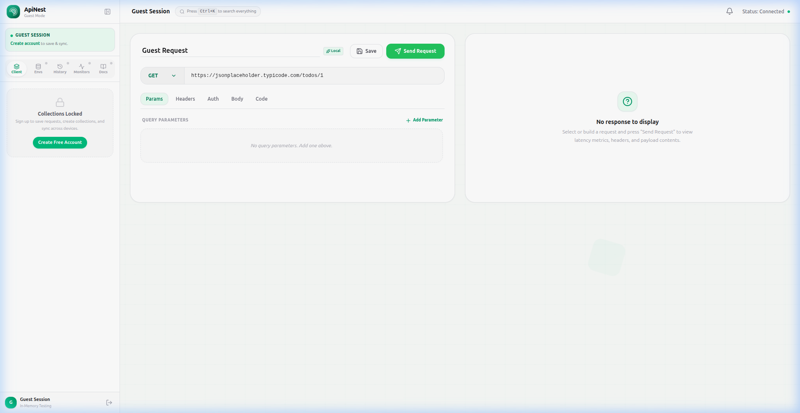
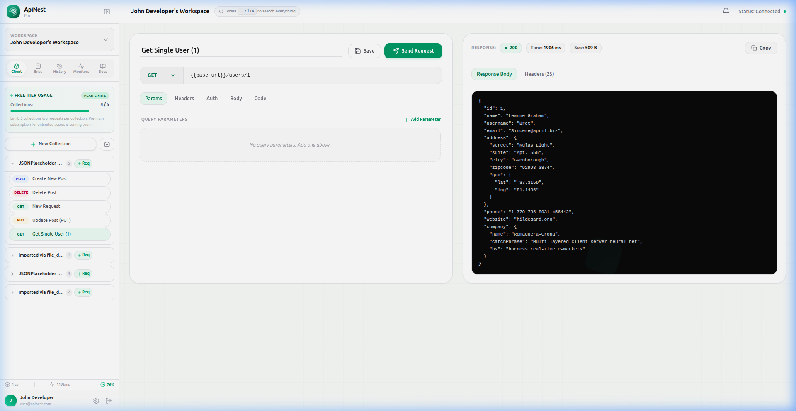
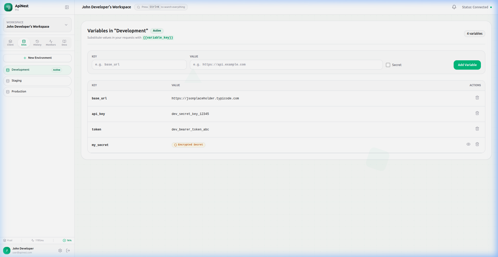
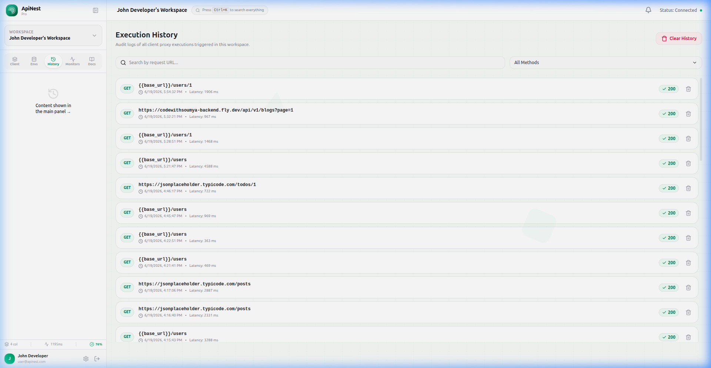
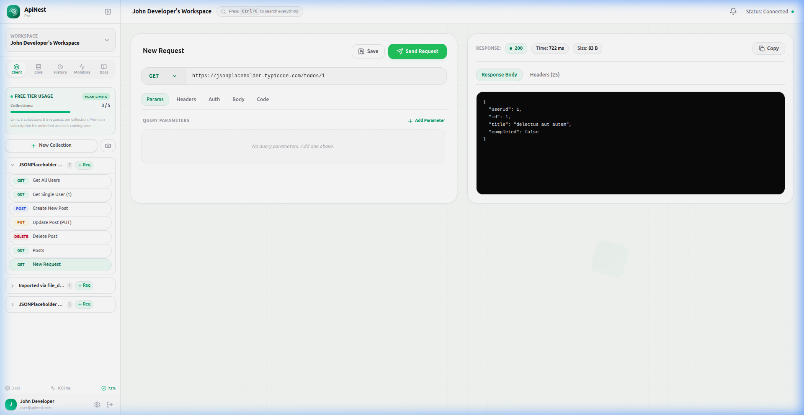
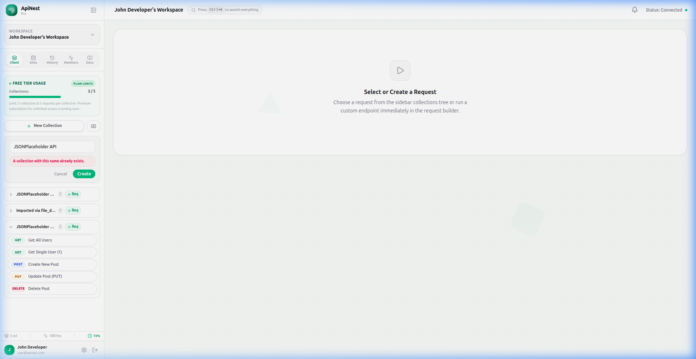
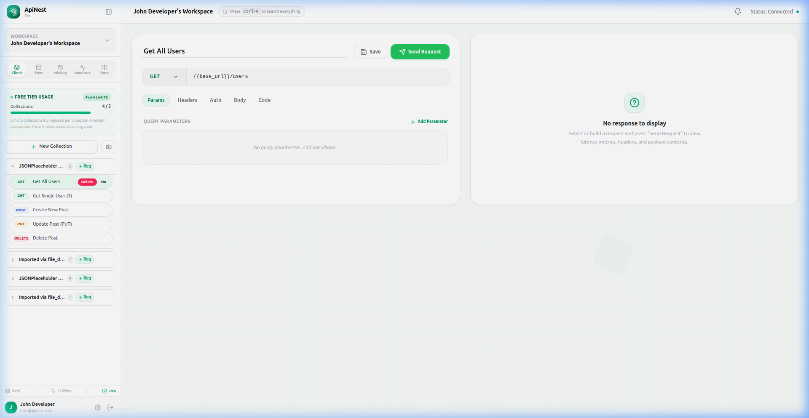

<p align="center">
  
  
  
  
  
</p>

# 🚀 ApiNest — Premium SaaS API Testing Platform

**ApiNest** is a developer-centric, premium SaaS platform for orchestrating, testing, and monitoring REST APIs — all from your browser. Think of it as a lightweight, beautifully designed alternative to Postman with collections, environments, request history, variable interpolation, and a freemium subscription model.

> Built with **React 19 + TypeScript** on the frontend and **Ruby on Rails API** on the backend.

---

## 📸 Screenshots

### Landing Page
A clean, modern landing page with instant guest access — no signup required. Includes a live preview of the API testing interface.



---

### Guest Mode Dashboard
Instantly start testing APIs without creating an account. The guest workspace provides a full-featured request builder with `GET`, `POST`, `PUT`, `PATCH`, and `DELETE` support.



---

### API Client — Collections & Response Viewer
Authenticated users get a complete workspace with organized collections, a request builder with params/headers/auth/body tabs, and a formatted JSON response viewer showing status codes, latency, and payload size.



---

### Environment Variables Manager
Configure scoped environment profiles (Development, Staging, Production) in the sidebar. Manage key-value variables with secret masking support. Use `{{variable_key}}` syntax in URLs, headers, and body to dynamically resolve values at runtime.



---

### Request Execution History
A full audit trail of every API call made in your workspace. Filter by HTTP method, search by URL, and review latency metrics for each execution.



---

### Free Tier Usage & Collection Limits
Visual progress tracker showing collection usage (X / 5). Inline validation errors appear directly under the relevant collection when limits are exceeded.



---

### Inline Validation & Duplicate Checks
Smart inline warnings prevent duplicate collection names and enforce request-per-collection limits. No annoying browser alerts — just clean, contextual feedback.



---

### Inline Deletion Confirmation
Custom stateful "Delete / Cancel" confirmation buttons replace generic browser prompts for a polished, non-intrusive deletion experience.



---

### Premium Feature Locks — Monitors & Notifications
Uptime monitoring and real-time alert notifications are reserved for the upcoming premium tier. Clean lock screens communicate the upgrade path.


---

## ✨ Key Features

### 🔌 Interactive HTTP Client
- Full support for `GET`, `POST`, `PUT`, `PATCH`, `DELETE` methods
- Tabbed request configuration: **Params**, **Headers**, **Auth**, **Body**, **Code**
- Auto-save on send — your request state syncs to the database automatically
- Response viewer with status code badges, execution time, payload size, and formatted JSON output
- Response panel auto-resets when switching between requests

### 📁 Collection & Request Management
- Organize requests into named collections with a sidebar tree view
- **Postman Import** — paste a Postman Collection JSON to bulk-import requests
- **Duplicate collections** with validation against name conflicts
- Inline stateful delete confirmations (no browser prompts)
- Free tier: **2 workspaces**, **5 collections** per workspace, **5 requests** per collection

### 🌍 Environments & Variable Interpolation
- Create scoped profiles: `Development`, `Staging`, `Production`
- Define key-value variables with optional **secret masking**
- Use `{{base_url}}`, `{{token}}`, etc. in URLs, headers, query params, and body
- Variables resolve dynamically at runtime before request execution

### 📊 Execution History
- Full audit log of every request execution in your workspace
- Search by URL and filter by HTTP method
- View timestamps, latency, and response status at a glance
- One-click clear history

### 🔔 Premium Features (Coming Soon)
- **Uptime Monitors** — recurring endpoint health checks with configurable intervals
- **Alert Notifications** — real-time alerts for API downtime and performance degradation
- **Unlimited collections & requests** — remove free tier caps

### 🎨 UI/UX Highlights
- Premium glassmorphic design with smooth Framer Motion animations
- Custom dropdown selects replacing native browser controls
- Responsive sidebar with expand/collapse toggle
- Toast notifications with success/error states
- Profile modal with workspace stats
- `Ctrl+K` command palette for quick search

---

## 🛠️ Tech Stack

| Layer | Technology |
|-------|-----------|
| **Frontend** | React 19, TypeScript, Vite 8 |
| **State** | Zustand |
| **Styling** | Tailwind CSS + Vanilla CSS |
| **Animations** | Framer Motion |
| **Routing** | React Router v7 |
| **Backend** | Ruby on Rails 7 (API mode) |
| **Database** | PostgreSQL |
| **Auth** | JWT (JSON Web Tokens) |
| **Background Jobs** | ActiveJob + Puma thread pools |

---

## 🚀 Getting Started

### Prerequisites
- **Ruby** `>= 3.2`
- **Node.js** `>= 18`
- **PostgreSQL** running locally

### Installation

**1. Clone the repository**
```bash
git clone https://github.com/soumyar78/api_nest.git
cd api_nest
```

**2. Backend Setup**
```bash
cd backend
bundle install
rails db:create db:migrate db:seed
rails server -p 3000
```
> The API server runs at `http://localhost:3000`

**3. Frontend Setup**
```bash
cd ../frontend
npm install
npm run dev
```
> Open `http://localhost:5173` in your browser

### 🔑 Demo Credentials
| Field | Value |
|-------|-------|
| Email | `user@apinest.com` |
| Password | `password123` |

Or click **"Start Testing Free"** on the landing page to use Guest Mode instantly.

---

## 📂 Project Structure

```
api_nest/
├── backend/                  # Rails API server
│   ├── app/
│   │   ├── controllers/      # API endpoints (collections, requests, environments, etc.)
│   │   ├── models/           # ActiveRecord models
│   │   ├── jobs/             # Background workers (monitor scheduler)
│   │   └── services/         # Request executor service
│   ├── config/               # Routes, database config, CORS
│   └── db/                   # Migrations & seeds
├── frontend/                 # React SPA
│   ├── src/
│   │   ├── components/       # UI components (RequestBuilder, ResponseViewer, CollectionTree, etc.)
│   │   ├── pages/            # Route pages (Landing, Login, Signup, Dashboard)
│   │   ├── store/            # Zustand state stores
│   │   └── lib/              # API client & utilities
│   └── public/               # Static assets
├── assets/                   # README screenshots
└── README.md
```

---

## 🔒 Plan Restrictions & Premium Model

ApiNest ships with a **freemium tier system** designed for future monetization:

| Feature | Free Tier | Premium (Coming Soon) |
|---------|-----------|----------------------|
| Workspaces | 2 max | Unlimited |
| Collections | 5 max per workspace | Unlimited |
| Requests / Collection | 5 max | Unlimited |
| Environment Profiles | ✅ | ✅ |
| Request History | ✅ | ✅ |
| Postman Import | ✅ | ✅ |
| Uptime Monitors | 🔒 Locked | ✅ |
| Alert Notifications | 🔒 Locked | ✅ |

---

## 📄 License

This project is open source and available under the [MIT License](LICENSE).

---

<p align="center">
  <strong>Built with ❤️ by <a href="https://github.com/soumyar78">Soumya Ranjan</a></strong>
</p>
