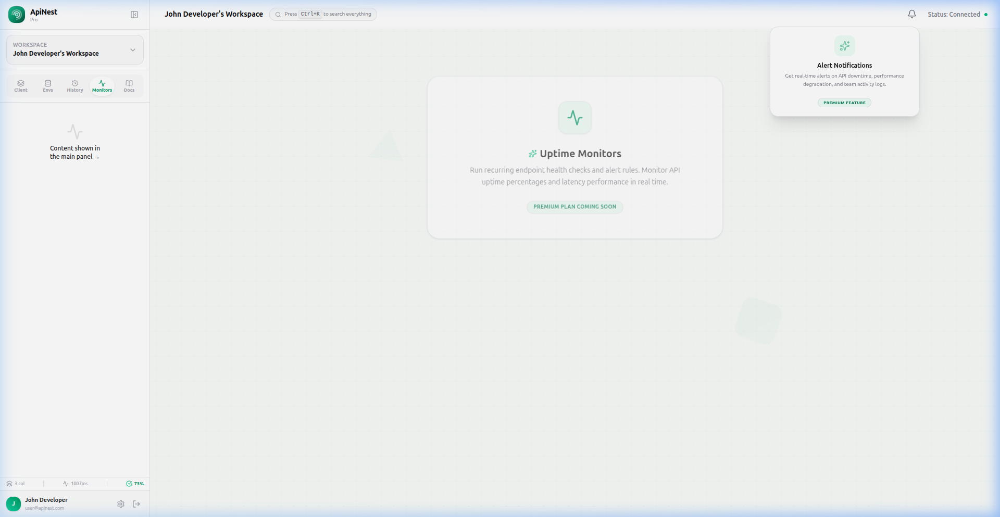
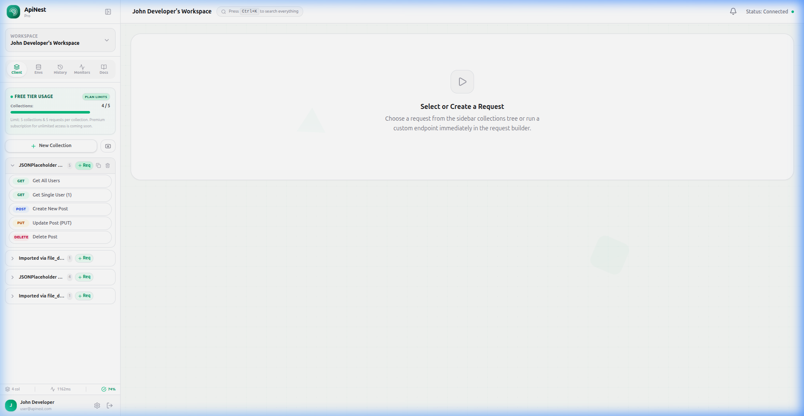

# 🚀 ApiNest — Premium SaaS API Testing Platform

ApiNest is a developer-centric, high-density, and premium SaaS platform designed for orchestrating, testing, and monitoring APIs. Built on a modern tech stack utilizing a **React 19 & TypeScript** frontend and a **Ruby on Rails API** backend, ApiNest provides a seamless, developer-friendly interface with rich aesthetics, real-time environment variable interpolation, and background monitor schedulers.

---

## 🎨 Screen Previews

### 1. High-Density API Workspace
A clean, layout-responsive workspace designed with modern typography, glassmorphism, custom dropdown controls, and auto-saving integrations.


### 2. Free Tier Usage Tracker & Limits
Free-tier accounts track resources using an embedded progress badge tracking collections out of 5, alerting users with clean inline errors when limits are reached.


### 3. Stateful Deletion Confirmation
Clean, inline confirms substitute generic browser prompt dialogues to make deleting requests or collections smooth and seamless.


---

## ✨ Key Features

### 1. Interactive HTTP Client
* **HTTP Methods**: Full orchestration for `GET`, `POST`, `PUT`, `DELETE`, and `PATCH`.
* **Multi-Format Payloads**: In-line query parameters, request header keys, authentication controls, and raw/JSON body configurations.
* **Auto-Save Sync**: Requests are silently saved to the backend database when executed or manually updated, keeping your state synced across sessions.
* **Response Viewer**: Displays status codes, execution response time, packet size, and formatted raw/JSON outputs. The viewer automatically resets when switching active requests.

### 2. Collection & Request Organization
* **Tree Hierarchy**: Group requests into collections.
* **Postman Importer**: Import your existing API suites by pasting standard Postman Collection JSON schemas directly.
* **Collection Duplication**: Clone collections and their requests instantly with built-in validation checks to prevent duplicate naming conflicts.
* **Inline Actions**: Custom stateful confirmations for deletions prevent accidental clicks without annoying browser-level alerts.

### 3. Environments & Variable Interpolation
* **Dynamic Scopes**: Configure environment profiles (e.g., `Dev`, `Staging`, `Prod`) in the left sidebar.
* **In-Line Resolvers**: Placeholders like `{{base_url}}` or `{{token}}` are dynamically resolved in real-time in request endpoints, headers, queries, and body content.
* **Credential Masking**: Support for masking and revealing secret environment variable values.

### 4. Background API Health Monitoring (Premium Upgrade)
* **Uptime Scheduling**: Configure uptime checks at regular intervals (e.g., every 1m, 5m, 15m) to continuously test target API endpoints.
* **Cron Jobs**: Orchestrated on the backend via Rails ActiveJob workers (`ApiMonitorSchedulerJob` and `ApiMonitorJob`) executing request executors.
* **Failure Alerts**: Automatically records failure metrics and pushes live notifications to the database feeding the status bell panel.

---

## 🛠️ Technical Architecture

### Frontend
* **Core**: [React 19](https://react.dev/), [TypeScript](https://www.typescriptlang.org/)
* **Build Tool**: [Vite](https://vitejs.dev/)
* **State Management**: [Zustand](https://github.com/pmndrs/zustand)
* **Styling**: Tailwind CSS & Vanilla CSS
* **Animations**: [Framer Motion](https://www.framer.com/motion/)
* **Routing**: [React Router](https://reactrouter.com/)

### Backend
* **API Framework**: [Ruby on Rails (API Mode)](https://rubyonrails.org/)
* **Database**: PostgreSQL (for persistent collection, request, workspace, and monitor storage)
* **Queue/Background Workers**: ActiveJob with Puma thread pools (handling automated monitor crons)

---

## 🚀 Getting Started

### Prerequisites
* **Ruby**: `^3.2`
* **Node.js**: `^18`
* **PostgreSQL** running locally

### Installation

1. **Clone the repository**:
   ```bash
   git clone https://github.com/soumyar78/api_nest.git
   cd api_nest
   ```

2. **Backend Setup**:
   ```bash
   cd backend
   bundle install
   rails db:create db:migrate db:seed
   rails server -p 3000
   ```
   The backend API will run at `http://localhost:3000`.

3. **Frontend Setup**:
   ```bash
   cd ../frontend
   npm install
   npm run dev
   ```
   Open `http://localhost:5173` to launch the client.

### Seed Credentials
To test all authenticated features, log in using the seed credentials:
* **Email**: `user@apinest.com`
* **Password**: `password123`

---

## 🔒 Plan Restrictions & Premium Hooks
ApiNest is designed with a freemium subscription tier system:
* **Free Tier Limits**: Max **5 collections** per workspace and **5 requests** per collection.
* **Premium Upgrades**: Real-time notification lists, email failure alerts, and automated uptime monitors are restricted to premium accounts with call-to-action lock modals.
